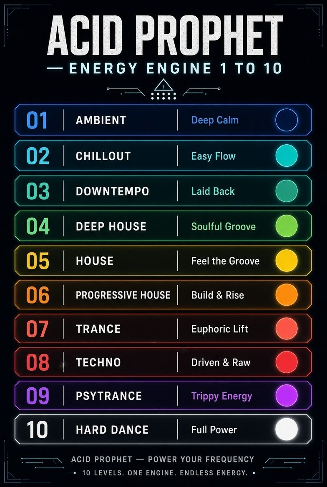
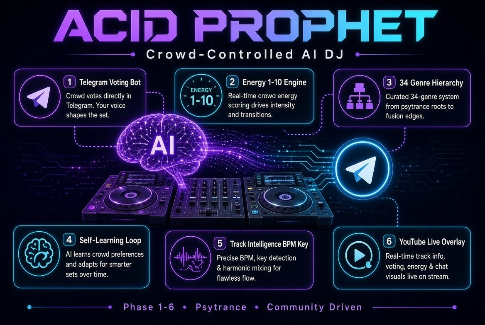
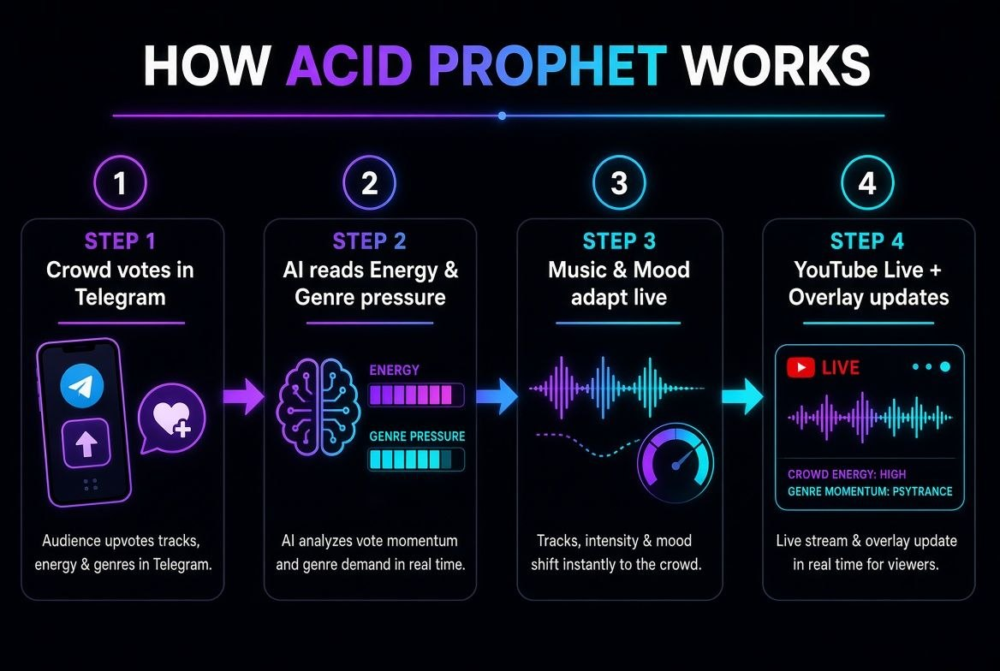
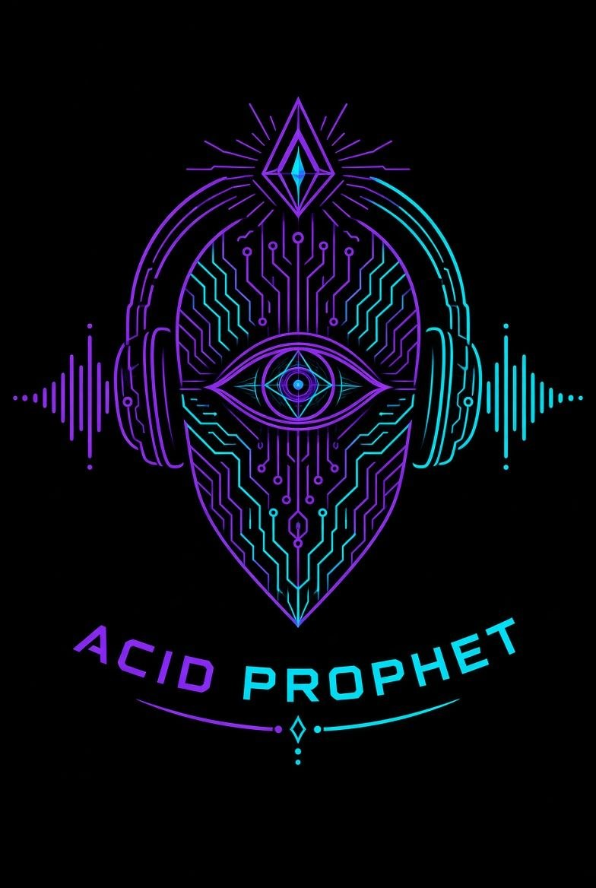

# Acid Prophet — The Crowd Controls The AI DJ

Telegram-voting Psytrance stream bot with Energy 1–10 engine, genre hierarchy, SQLite state, self-improving learning loop and YouTube Live integration.

**Status:** Phase 1 live · Phase 2 learning active · Phase 4/5/6 in progress

**Repo:** https://github.com/PromptBrainless/acid-prophet

---

## What it does

| Feature | Status |
|---|---|
| Telegram bot (`/start`, `/status`, `/energy`, `/genre`) | ✅ Live |
| Energy engine 1–10 with colors and moods | ✅ Live |
| Genre hierarchy (34 genres from Electronic Music Map) | ✅ Live |
| SQLite state persistence (survives restarts) | ✅ Live |
| Health timer + auto-recovery | ✅ Live |
| Self-improving learning loop (collect → analyze → pending) | ✅ Live |
| Context compression (`compress_context.py`) | ✅ Live |
| Voting (`/upvote`, `/downvote`, `/moreenergy`, `/lessenergy`) | 🔜 Phase 4 |
| Track Intelligence (mixxx-analyzer) | 🔜 Phase 5 |
| YouTube Live overlay (ffplayout API) | 🔜 Phase 6 |
|| YouTube stream (pending stream key) | ⏳ Waiting |

---

## Visual Identity







---

## Architecture

```
Trigger / Event
    → learning/collect.py        (logs, votes, errors)
    → learning/analyze.py        (patterns, thresholds)
    → optional: LLM refine       (→ memory/pending/)
    → apply_lesson.py            (→ memory/lessons/)
    → smoke tests / rollback
```

State lives in SQLite + `memory/lessons/`. The bot never stores secrets in code or Git.

---

## Prerequisites

- Linux server (tested on Ubuntu/Debian)
- Python 3.11+
- `python-telegram-bot` (installed in venv)
- systemd user instance
- FFmpeg (for YouTube/stream features)
- Optional: `mixxx-analyzer` for track intelligence
- Telegram bot token from [@BotFather](https://t.me/BotFather)

---

## Quick Start

```bash
# 1. Clone
git clone https://github.com/PromptBrainless/acid-prophet.git
cd acid-prophet

# 2. Create venv and install deps
python3 -m venv .venv
source .venv/bin/activate
pip install "python-telegram-bot[job-queue]" python-dotenv

# 3. Configure token
cp .env.example .env
nano .env   # TELEGRAM_BOT_TOKEN eintragen

# 4. Install systemd user services
mkdir -p ~/.config/systemd/user
cp systemd/acid-prophet.service ~/.config/systemd/user/
cp systemd/acid-prophet-health.timer ~/.config/systemd/user/
cp systemd/acid-learning.timer ~/.config/systemd/user/
systemctl --user daemon-reload
systemctl --user enable --now acid-prophet.service
systemctl --user enable --now acid-prophet-health.timer
systemctl --user enable --now acid-learning.timer

# 5. Verify
systemctl --user status acid-prophet.service
journalctl --user -u acid-prophet.service -f
```

---

## Project Structure

```
acid-prophet/
├── AGENTS.md              # Agent rules + learning-loop policy
├── MEMORY.md              # Memory retrieval + write rules
├── LEARNING.md            # Learning loop documentation
├── MASTER_EXECUTION.md    # Phase 0–10 roadmap
├── PROJEKT.md             # Project documentation
├── CHANGELOG.md           # Change log
├── ELECTRONIC_MUSIC_MAP.md # Genre poster design notes
├── README.md              # This file
├── .env.example           # Template (token, paths)
├── .gitignore
├── app/
│   ├── __init__.py
│   ├── bot.py             # Telegram bot handlers
│   ├── config.py          # dotenv configuration
│   ├── db.py              # SQLite (app_state, votes, tracks, missions)
│   ├── energy.py          # Energy 1–10 → colors + moods
│   └── genres.py          # Genre hierarchy + validation
├── config/
│   └── genres.json        # 34 genres with BPM, energy, mood, origin
├── learning/
│   ├── collect.py         # Collect logs, votes, errors
│   ├── analyze.py         # Pattern detection
│   ├── refine.py          # Manual lesson creation (/refine)
│   ├── compress_context.py # Context compression
│   └── apply_lesson.py    # Move pending → lessons
├── memory/
│   ├── index.json         # Master index (lessons, skills, goals)
│   ├── lessons/           # Approved lessons
│   ├── pending/           # Awaiting approval
│   └── episodes/          # Session summaries
├── scripts/
│   ├── bot-health.sh      # Health check + auto-recovery
│   └── learning-loop.sh   # collect → analyze
├── systemd/
│   ├── acid-prophet.service
│   ├── acid-prophet-health.service
│   ├── acid-prophet-health.timer
│   ├── acid-learning.service
│   └── acid-learning.timer
├── data/                  # SQLite DB (gitignored)
├── logs/                  # Bot + health logs (gitignored)
├── reports/               # signals-*.json, compressed-context.txt
├── overlays/              # YouTube overlay assets
└── backups/               # Tar.gz backups (gitignored)
```

---

## Bot Commands

| Command | Description |
|---|---|
| `/start` | Initialize bot, show energy + genre |
| `/status` | Current state (energy, genre, uptime) |
| `/energy <1-10>` | Set energy level |
| `/genre +1` / `/genre -1` | Navigate genre hierarchy |
| `/upvote` | Vote up current track |
| `/downvote` | Vote down current track |
| `/moreenergy` | Request higher energy |
| `/lessenergy` | Request lower energy |
| `/refine <title> <rule>` | Create pending lesson |
| `/compress` | Compress context |

---

## Energy System

| Level | Genre | Color | Mood |
|---|---|---|---|
| 1 | Ambient | `#001F3F` | Meditativ |
| 2 | Chillout | `#006D77` | Entspannt |
| 3 | Downtempo | `#2A9D8F` | Dreamy |
| 4 | Deep House | `#52B788` | Warm |
| 5 | House | `#F4D35E` | Fröhlich |
| 6 | Progressive House | `#F4A261` | Euphorisch |
| 7 | Trance | `#E76F51` | Episch |
| 8 | Techno | `#D62828` | Treibend |
| 9 | Psytrance | `#9D4EDD` | Psychedelisch |
| 10 | Hard Dance | `#FFFFFF` | Maximale Energie |

---

## Genre Hierarchy

```
Atmospheric → House → Trance → Techno → Psy → Bass → Hard Dance
```

Navigate with `/genre +1` (forward) and `/genre -1` (backward). Full list in `config/genres.json`.

---

## Learning System

### How it works

1. **Collect** (`learning/collect.py`) — gathers votes, errors, health restarts
2. **Analyze** (`learning/analyze.py`) — detects patterns (energy bias, error spikes)
3. **Refine** (`learning/refine.py`) — manual lesson creation via `/refine`
4. **Apply** (`learning/apply_lesson.py`) — moves approved lessons to `memory/lessons/`
5. **Compress** (`learning/compress_context.py`) — reduces context when needed

### Triggers

| Trigger | Action |
|---|---|
| Timer (6h) | Full learning loop |
| `/refine` | Manual lesson → `pending/` |
| Health FAIL | Collect signals |
| 50+ votes | Analyze patterns |

### Safety

- KI writes **only** to `memory/pending/`
- `apply_lesson.py` moves to `memory/lessons/` after approval
- No secrets are ever written by learning scripts
- Rollback: delete lesson JSON or restore from `memory/pending/`

---

## Configuration

### `.env` variables

```bash
TELEGRAM_BOT_TOKEN=your_bot_token_here
DJ_STREAM_DB=/srv/dj-stream/data/acid_prophet.db
DJ_STREAM_TIMEZONE=Europe/Berlin
FFPLAYOUT_API=http://127.0.0.1:8787   # optional
FFPLAYOUT_TOKEN=                        # optional
FFPLAYOUT_CHANNEL=1                     # optional
```

---

## systemd Services

### Bot Service (`acid-prophet.service`)

- Type: `simple`
- Restart: `on-failure` (5s delay)
- Working dir: `/srv/dj-stream`
- Logs: `journalctl --user -u acid-prophet.service -f`

### Health Timer (`acid-prophet-health.timer`)

- Interval: 1 minute
- Script: `scripts/bot-health.sh`
- Auto-restart on failure

### Learning Timer (`acid-learning.timer`)

- Interval: 6 hours (after 10min boot delay)
- Script: `scripts/learning-loop.sh`
- Output: `reports/signals-*.json`

---

## Troubleshooting

```bash
# Check bot status
systemctl --user status acid-prophet.service

# View logs
journalctl --user -u acid-prophet.service -n 50 --no-pager

# Restart bot
systemctl --user restart acid-prophet.service

# Run learning loop manually
cd /srv/dj-stream && bash scripts/learning-loop.sh

# Check pending lessons
ls -la /srv/dj-stream/memory/pending/

# Compress context
python3 /srv/dj-stream/learning/compress_context.py
```

---

## Rollback

```bash
# Restore from backup
cd /srv/dj-stream
tar -xzf backups/prechange-*.tar.gz

# Disable services
systemctl --user disable --now acid-prophet.service
systemctl --user disable --now acid-prophet-health.timer
systemctl --user disable --now acid-learning.timer
```

---

## Roadmap

| Phase | Status | Description |
|---|---|---|
| Phase 0 | ✅ Done | Inventory, backup, directory structure |
| Phase 1 | ✅ Done | Bot core, SQLite, energy, genres, systemd |
| Phase 2 | ✅ Done | Learning loop, memory system, context compression |
| Phase 3 | 🔜 Next | Track Intelligence (mixxx-analyzer) |
| Phase 4 | 🔜 Next | Voting handlers |
| Phase 5 | 🔜 Next | YouTube overlay (ffplayout API) |
| Phase 6 | ⏳ Pending | YouTube stream (awaiting stream key) |

---

## Contributing

This is a personal project. Lessons and improvements are managed via the built-in learning loop (`memory/pending/` → `memory/lessons/`).

## License

Private — all rights reserved.

---

Generated: 2026-09-04 · Agent: Hermes (Nous Research) · Host: homeserver (100.69.81.38)
